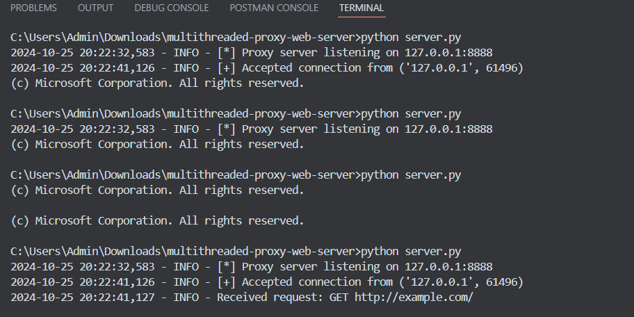
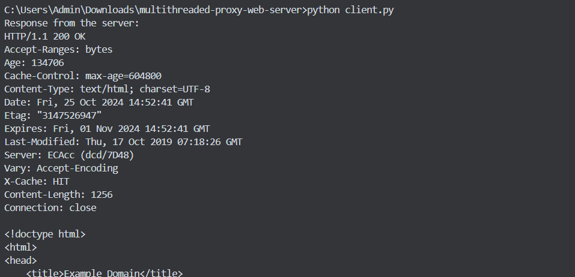

# Multithreaded Proxy Web Server Python    
This project implements a multithreaded HTTP/HTTPS proxy web server in Python. The proxy server listens for client requests, forwards them to the appropriate target server, and returns the responses back to the clients. It includes features such as HTTPS support, request logging, and multithreading using a thread pool.

# Features
HTTP and HTTPS Support: Supports both HTTP and HTTPS connections, forwarding encrypted HTTPS traffic without decryption.
=>Multithreading: Handles multiple client connections concurrently with thread pooling to manage resources efficiently.
=>Logging: Logs details of incoming requests and responses, providing insight into server activity.
=>Error Handling: Basic error handling to manage network and connection errors gracefully.

# Components
=>Proxy Server: The core server that listens for incoming client requests and forwards them to the target servers.
=>Client: A sample client script to test HTTP request handling through the proxy server.

# Directory Structure
├── proxy_server.py    # Main proxy server script
├── client_demo.py     # Client script to test the proxy server
└── README.md          # Documentation (this file)

# Requirements
Python 3.x

# Installation
=>Clone this repository and navigate to the project directory:
=>git clone https://github.com/kohlisaurabhsagar/multithreaded-proxy-server.git
=>cd multithreaded-proxy-server

# Usage
=>Running the Proxy Server
=>Run the proxy_server.py script to start the proxy server.
=>python proxy_server.py
=>By default, the server listens on 127.0.0.1:8888 for incoming client requests. This can be changed in the script by modifying    
  PROXY_HOST and PROXY_PORT variables.
=>Once started, the proxy server logs incoming connections, request types, and target hosts in the console.
=>Testing with the Client
=>Run the client.py script to test an HTTP GET request through the proxy server.
=>python client.py
=>This  client connects to the proxy server, sends an HTTP GET request, and prints the response received from the target server.

# Browser Setup (Optional)
=>To route browser traffic through the proxy:
=>Set browser’s proxy settings to 127.0.0.1:8888.
=>Visit any website in browser, and you should see logs in the proxy server indicating the forwarded requests.

# Code Overview
=>Proxy Server (proxy_server.py)
=>The main components of the proxy server include:
-handle_client(): This function handles individual client requests. It parses the request, determines the HTTP method, and forwards it to the target server. It supports both HTTP and HTTPS requests.
-handle_https(): This function manages HTTPS connections by establishing a tunnel between the client and target server.
-start_proxy(): Initializes the server, starts listening for incoming connections, and manages multithreading using a ThreadPoolExecutor.
-Client (client.py)
This script acts as a simple client to test HTTP requests through the proxy. It connects to the proxy server, sends a basic HTTP GET request, and prints the target server’s response to the console.

# Example Output
---Proxy Server Output

After starting the server and connecting the client, you should see logs like the following in the server console:
[*] Proxy server listening on 127.0.0.1:8888
[+] Accepted connection from ('127.0.0.1', 55062)
Received request: GET http://example.com/
Forwarding response to client...
[+] Accepted connection from ('127.0.0.1', 55063)
Received request: CONNECT www.example.com:443
Establishing HTTPS tunnel...

----Client Output

Running client_demo.py should print the response received from the target server, such as the HTML content for http://example.com.

# Configuration
You can adjust the following parameters in proxy_server.py:
=>PROXY_HOST: IP address for the proxy server (default: 127.0.0.1).
=>PROXY_PORT: Port number for the proxy server (default: 8888).
=>MAX_THREADS: Maximum number of threads in the thread pool to manage simultaneous connections.
  Limitations
=>HTTPS Content: This proxy does not decrypt HTTPS content; it only establishes a tunnel for encrypted HTTPS traffic.
=>Error Handling: While basic error handling is implemented, additional error checking and exception handling may be needed for production use.
Caching: This proxy does not cache responses.

# Future Improvements
=>Advanced HTTPS Handling: Adding support for HTTPS decryption and inspection (requires certificates and security handling).
=>Request Caching: Implementing a caching mechanism to reduce repeated requests for the same resources.
=>Access Control: Adding IP whitelisting/blacklisting to control access to the proxy server.
    
# Conceptual Overview

    ┌───────────────────────┐                      ┌───────────────────────┐
    │        Client         │                      │    Target Server      │
    │    (Browser, etc.)    │                      │ (example.com, etc.)   │
    └─────────┬─────────────┘                      └──────────┬────────────┘
              │                                               │
              │                                               │
1. Connect to Proxy Server                           6. Receive Request
       (HTTP or HTTPS) ─────────────────────────────────────>  │
              │                                               │
              │                                               │
    ┌─────────▼────────────┐                      ┌───────────▼───────────┐
    │   Proxy Server       │                      │ Parse Request and      │
    │ (Listens for Client  │                      │ Generate Response      │
    │   Connections)       │                      └───────────┬───────────┘
    └─────────┬────────────┘                                  │
              │                                               │
              │                                               │
2. Parse HTTP Method, Target Host, and Port                   │
              │                                               │
              │                                               │
              │      ┌───────────────────────────┐            │
              │      │   "CONNECT" Method?       │            │
              │      │ (HTTPS traffic uses this) │            │
              │      └───────────┬───────────────┘            │
              │                  │                            │
              │                  │                            │
              │                  ▼                            │
              │        ┌──────────────┐                       │
              │        │ Initiate HTTPS│                      │
              │        │  Tunnel       │                      │
              │        └───────┬───────┘                      │
              │                │                              │
3. Forward Client Requests     │                              │
   to Target Server ──────────>│                              │
   (HTTP or HTTPS)             │                              │
                               │                              │
              │                │    7. Send Response to Proxy │
              │                │   <──────────────────────────┘
              │                │                              │
4. Receive Response            │
   from Target Server  ◄───────┘
              │
              │
5. Forward Response
   Back to Client ◄──────────────────────────────────────────┘

